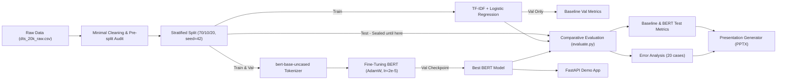

# 02. Project Specification: Ứng Dụng BERT Trong Phân Loại Cảm Xúc Đánh Giá Khách Sạn

**Tên dự án (Tiếng Việt):** Ứng dụng BERT trong phân loại cảm xúc đánh giá khách sạn  
**Tên dự án (Tiếng Anh):** Fine-Tuning BERT for Hotel Review Sentiment Classification  
**Phương pháp luận:** Tuân thủ chuẩn mực quy trình `AI Project Cycle` (Scope -> Data -> Models -> Deployment -> Maintenance -> Feedback)

---

## 1. Problem Statement (Phát biểu bài toán)
Ngành du lịch và khách sạn phụ thuộc rất lớn vào phản hồi và trải nghiệm của khách hàng trực tuyến. Với hàng ngàn lượt đánh giá được đăng tải mỗi ngày trên các nền tảng như Booking.com, TripAdvisor hay Agoda, việc phân loại thủ công cảm xúc của khách hàng là bất khả thi về mặt chi phí và thời gian. 

Bài toán đặt ra: **Tự động phân loại sắc thái cảm xúc (Sentiment) của một văn bản đánh giá khách sạn bằng tiếng Anh thành Tích cực (Positive) hoặc Tiêu cực (Negative)**, giúp ban quản lý khách sạn kịp thời nhận diện các khiếu nại nghiêm trọng cũng như ghi nhận các điểm làm hài lòng khách hàng.

---

## 2. Motivation (Động lực nghiên cứu)
- **Hạn chế của NLP truyền thống:** Các phương pháp như Bag-of-Words (BoW) hoặc TF-IDF kết hợp với Machine Learning truyền thống (Naive Bayes, Logistic Regression) xem văn bản là một "túi từ" rời rạc, không nắm bắt được thứ tự từ, ngữ cảnh đa chiều và các cấu trúc ngữ pháp phức tạp như đảo ngữ, phủ định kép ("not bad at all") hay châm biếm.
- **Hạn chế của RNN/LSTM:** Xử lý tuần tự theo thời gian, thời gian huấn luyện lâu, dễ gặp hiện tượng suy biến gradient khi câu quá dài.
- **Sức mạnh của BERT (Bidirectional Encoder Representations from Transformers):** Cơ chế Self-Attention đa đầu (Multi-Head Self-Attention) cho phép mô hình nhìn đồng thời cả ngữ cảnh bên trái và bên phải của mỗi từ, tạo ra vector biểu diễn ngữ nghĩa phụ thuộc sâu sắc vào văn cảnh.
- **Tính khả thi của Fine-tuning:** Thay vì huấn luyện một mô hình ngôn ngữ khổng lồ từ đầu (tốn hàng triệu USD và hàng ngàn giờ GPU), ta kế thừa trọng số đã được tiền huấn luyện trên hàng tỷ từ và tinh chỉnh lại một cách hiệu quả trên tập dữ liệu đặc thù.

---

## 3. Input & Output Specification
- **Input:** Một chuỗi văn bản tự nhiên bằng tiếng Anh biểu diễn nhận xét của khách hàng về dịch vụ khách sạn.
  - *Ví dụ 1:* `"The room was spacious, bed was very comfortable, and breakfast was amazing!"`
  - *Ví dụ 2:* `"Terrible experience. The air conditioner was broken and staff was rude."`
- **Output:** 
  - Nhãn phân loại nhị phân: `1` (Positive / Tích cực) hoặc `0` (Negative / Tiêu cực).
  - Độ tin cậy (Confidence Score) tương ứng trong khoảng $[0.0, 1.0]$.

---

## 4. Stakeholders (Các bên liên quan)
Dựa theo Slide 4 của `AI Project Cycle.pptx`:
1. **Khách hàng (Hotel Guests):** Người để lại đánh giá, mong muốn phản hồi của mình được lắng nghe và xử lý.
2. **Bộ phận Quản lý Khách sạn (Hotel Management & Operations):** Cần hệ thống phân loại tự động theo thời gian thực để ưu tiên xử lý các phản hồi tiêu cực ngay lập tức và cải thiện chất lượng phục vụ.
3. **Đội ngũ Kỹ sư AI / Sinh viên thực hiện:** Thiết kế, huấn luyện, đánh giá mô hình, kiểm soát hiện tượng rò rỉ dữ liệu và triển khai bản demo có thể kiểm chứng.
4. **Giảng viên & Hội đồng chấm thi:** Đánh giá tính đúng đắn về mặt khoa học, phương pháp luận học thuật, khả năng giải thích và tính trung thực của kết quả thực nghiệm.

---

## 5. Project Objective (Mục tiêu dự án)
1. Xây dựng một quy trình chuẩn từ dữ liệu thô, làm sạch phù hợp với Transformer và kiểm soát giao thoa dữ liệu giữa các split.
2. Thiết lập mô hình cơ sở vững chắc (**TF-IDF + Logistic Regression**) làm mốc so sánh tối thiểu theo tinh thần AI Project Cycle.
3. Triển khai fine-tuning chuẩn mực mô hình `google-bert/bert-base-uncased` với thư viện Hugging Face `transformers` và `PyTorch`.
4. Đánh giá toàn diện mô hình trên tập kiểm thử độc lập (Test Set) qua các chỉ số: Accuracy, Precision, Recall, Macro/Weighted F1 và Confusion Matrix.
5. Thực hiện phân tích lỗi chuyên sâu (Error Analysis) trên các mẫu dự đoán sai.
6. Đóng gói ứng dụng demo tương tác cục bộ bằng `FastAPI`, Jinja2, CSS và JavaScript thuần; đồng thời triển khai bộ công cụ sinh slide thuyết trình học thuật.

---

## 6. Research Questions (Câu hỏi nghiên cứu)
1. **RQ1 (Baseline vs. Fine-Tuned BERT):** Mô hình BERT được fine-tune đúng chuẩn có thực sự đem lại hiệu năng vượt trội so với mô hình học máy truyền thống (TF-IDF + Logistic Regression) trên tập dữ liệu đánh giá khách sạn hay không?
2. **RQ2 (Contextual Representation Impact):** Biểu diễn ngữ cảnh sâu hai chiều (deep bidirectional contextual representation) của BERT giải quyết các sắc thái ngôn ngữ (từ đa nghĩa, trật tự từ, từ phủ định, cấu trúc nhượng bộ) tốt hơn mô hình túi từ như thế nào?
3. **RQ3 (Error Patterns):** Những trường hợp ngôn ngữ nào (cảm xúc pha trộn, đảo ngữ phức tạp, châm biếm/mỉa mai, giới hạn độ dài cắt cụt) vẫn là thách thức khiến mô hình dự đoán sai?

---

## 7. Success Criteria (Tiêu chí thành công)
Bám sát tinh thần AI Project Cycle, dự án không đặt các chỉ số võ đoán trước thực nghiệm mà xác định các tiêu chí cốt lõi:
1. **Pipeline chuẩn mực và toàn vẹn:** Tiền xử lý tối thiểu bảo tồn ngữ cảnh, không lỗi tương thích API thư viện (`processing_class`).
2. **Bảo vệ tập kiểm thử & Kiểm soát giao thoa (Sealed Test Set & Overlap Control):** Không dùng nhãn, dự đoán hay chỉ số Test để ra quyết định mô hình/siêu tham số trước lượt đánh giá cuối. Pipeline xác nhận 0 văn bản trùng khớp chính xác giữa các tập; kiểm toán hậu nghiệm có `casefold()` phát hiện một số ít giao thoa khác biệt chủ yếu ở chữ hoa/thường và được ghi nhận như một giới hạn.
3. **So sánh đối đầu công bằng (Fair Comparison):** Baseline (TF-IDF + LR) và Fine-Tuned BERT được đánh giá trên cùng tập Test với cùng tiêu chuẩn đo lường trong cùng một lượt chạy của `src/evaluate.py`.
4. **Trung thực trong báo cáo (Honest Reporting):** Toàn bộ kết quả thực nghiệm được ghi nhận trực tiếp từ log thực thi, không tự ý suy diễn các chỉ số chưa được chạy.
5. **Tính tái lập có kiểm soát (Controlled Reproducibility):** Cố định random seed `42` và tài liệu hóa chi tiết môi trường thực thi (`controlled for reproducibility with fixed seeds and documented environment`).

---

## 8. Constraints & Assumptions (Ràng buộc & Giả định)
- **Tài nguyên tính toán:** Dự án hỗ trợ chạy trên GPU cục bộ hoặc phương án dự phòng trên Google Colab GPU (T4).
- **Ràng buộc dữ liệu:** Sử dụng tập dữ liệu `dts_20k_raw.csv` do giảng viên cung cấp (teacher-provided dataset).
- **Ràng buộc tiền xử lý:** BERT đã có tokenizer WordPiece được huấn luyện trước trên văn bản tự nhiên, do đó KHÔNG loại bỏ stopwords và KHÔNG lemmatize câu làm phá hủy ngữ pháp tự nhiên.
- **Độ dài chuỗi (Max Length):** Đã xác nhận lựa chọn **128** dựa trên phân vị độ dài token thực tế từ EDA trên tập Train+Val (p95 = 121.0 tokens, chỉ cắt cụt 3.93%) giúp tối ưu hóa chi phí tính toán $\mathcal{O}(L^2)$ so với ngưỡng 256 (tăng $4\times$ kích thước ma trận chú ý nhưng chỉ tăng thêm 3.84% độ phủ văn bản). Mức tiêu thụ bộ nhớ và thời gian thực thi thực tế sẽ được đo lường cụ thể trong quá trình huấn luyện.

---

## 9. Project Pipeline

---

## 10. Expected Deliverables (Sản phẩm bàn giao)
1. **Mã nguồn hoàn chỉnh (`src/`):** `data.py`, `train_baseline.py`, `train_bert.py`, `evaluate.py`, `predict.py` (chạy dạng module `python -m src.<module>`).
2. **Tài liệu học thuật (`docs/`):** Audit tài liệu, Đặc tả bài toán, Phân tích mã nguồn cũ (tham khảo nội bộ), Khung phân tích lỗi, Cẩm nang học tập (`STUDY_GUIDE.md`), Bộ câu hỏi phản biện (`DEFENSE_QA.md`).
3. **Artifacts thực nghiệm:** Toàn bộ metrics dạng JSON và biểu đồ trực quan hóa độ phân giải cao trong `artifacts/`.
4. **Notebook Google Colab (`notebooks/`):** Hỗ trợ tính năng "Run All" trơn tru cho sinh viên.
5. **Ứng dụng Demo (`app/main.py`):** Giao diện FastAPI/Jinja2 cục bộ, hiển thị nhãn và xác suất đầu ra thực tế của BERT.
6. **Báo cáo & Bài thuyết trình (`presentation/` & `FINAL_REPORT.md`):** Hoàn tất báo cáo tổng kết và bài thuyết trình PowerPoint (`presentation/BERT_Project_Final.pptx`) theo DUT-style template supplied for this project.
