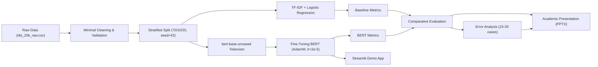

# 02. Project Specification: Ứng Dụng BERT Trong Phân Loại Cảm Xúc Đánh Giá Khách Sạn

**Tên dự án (Tiếng Việt):** Ứng dụng BERT trong phân loại cảm xúc đánh giá khách sạn  
**Tên dự án (Tiếng Anh):** Fine-Tuning BERT for Hotel Review Sentiment Classification  
**Phương pháp luận:** Tuân thủ chuẩn mực quy trình `AI Project Cycle` (Scope -> Data -> Models -> Deployment -> Maintenance -> Feedback)

---

## 1. Problem Statement (Phát biểu bài toán)
Ngành du lịch và khách sạn phụ thuộc rất lớn vào phản hồi và trải nghiệm của khách hàng trực tuyến. Với hàng ngàn lượt đánh giá được đăng tải mỗi ngày trên các nền tảng như Booking.com, TripAdvisor hay Agoda, việc phân loại thủ công cảm xúc của khách hàng là bất khả thi về mặt chi phí và thời gian. 

Bài toán đặt ra: **Tự động phân loại sắc thái cảm xúc (Sentiment) của một văn bản đánh giá khách sạn bằng tiếng Anh thành Tích cực (Positive) hoặc Tiêu cực (Negative)**, giúp ban quản lý khách sạn kịp thời nhận diện các khiếu nại nghiêm trọng cũng như ghi nhận các điểm làm hài lòng khách hàng.

---

## 2. Motivation (Động lực nghiên cứu)
- **Hạn chế của NLP truyền thống:** Các phương pháp như Bag-of-Words (BoW) hoặc TF-IDF kết hợp với Machine Learning truyền thống (Naive Bayes, Logistic Regression) xem văn bản là một "túi từ" rời rạc, không nắm bắt được thứ tự từ, ngữ cảnh đa chiều và các cấu trúc ngữ pháp phức tạp như đảo ngữ, phủ định kép ("not bad at all") hay châm biếm.
- **Hạn chế của RNN/LSTM:** Xử lý tuần tự theo thời gian, thời gian huấn luyện lâu, dễ gặp hiện tượng suy biến gradient khi câu quá dài.
- **Sức mạnh của BERT (Bidirectional Encoder Representations from Transformers):** Cơ chế Self-Attention đa đầu (Multi-Head Self-Attention) cho phép mô hình nhìn đồng thời cả ngữ cảnh bên trái và bên phải của mỗi từ, tạo ra vector biểu diễn ngữ nghĩa phụ thuộc sâu sắc vào văn cảnh.
- **Tính khả thi của Fine-tuning:** Thay vì huấn luyện một mô hình ngôn ngữ khổng lồ từ đầu (tốn hàng triệu USD và hàng ngàn giờ GPU), ta kế thừa trọng số đã được tiền huấn luyện trên hàng tỷ từ và tinh chỉnh lại một cách hiệu quả trên tập dữ liệu đặc thù.

---

## 3. Input & Output Specification
- **Input:** Một chuỗi văn bản tự nhiên bằng tiếng Anh biểu diễn nhận xét của khách hàng về dịch vụ khách sạn.
  - *Ví dụ 1:* `"The room was spacious, bed was very comfortable, and breakfast was amazing!"`
  - *Ví dụ 2:* `"Terrible experience. The air conditioner was broken and staff was rude."`
- **Output:** 
  - Nhãn phân loại nhị phân: `1` (Positive / Tích cực) hoặc `0` (Negative / Tiêu cực).
  - Độ tin cậy (Confidence Score) tương ứng trong khoảng $[0.0, 1.0]$.

---

## 4. Stakeholders (Các bên liên quan)
Dựa theo Slide 4 của `AI Project Cycle.pptx`:
1. **Khách hàng (Hotel Guests):** Người để lại đánh giá, mong muốn phản hồi của mình được lắng nghe và xử lý.
2. **Bộ phận Quản lý Khách sạn (Hotel Management & Operations):** Cần hệ thống phân loại tự động theo thời gian thực để ưu tiên xử lý các phản hồi tiêu cực ngay lập tức và cải thiện chất lượng phục vụ.
3. **Đội ngũ Kỹ sư AI / Sinh viên thực hiện:** Thiết kế, huấn luyện, đánh giá mô hình, kiểm soát hiện tượng rò rỉ dữ liệu và triển khai bản demo có thể kiểm chứng.
4. **Giảng viên & Hội đồng chấm thi:** Đánh giá tính đúng đắn về mặt khoa học, phương pháp luận học thuật, khả năng giải thích và tính trung thực của kết quả thực nghiệm.

---

## 5. Project Objective (Mục tiêu dự án)
1. Xây dựng một quy trình chuẩn từ dữ liệu thô, làm sạch phù hợp với Transformer, phân chia dữ liệu không rò rỉ.
2. Thiết lập mô hình cơ sở vững chắc (**TF-IDF + Logistic Regression**) làm mốc so sánh tối thiểu.
3. Phân tích nguyên nhân thất bại của triển khai BERT cũ trong tài liệu môn học (`DL_Model.ipynb`).
4. Triển khai fine-tuning chuẩn mực mô hình `google-bert/bert-base-uncased` với thư viện Hugging Face `transformers` và `PyTorch`.
5. Đánh giá toàn diện mô hình trên tập kiểm thử độc lập (Test Set) qua các chỉ số: Accuracy, Precision, Recall, Macro/Weighted F1 và Confusion Matrix.
6. Thực hiện phân tích lỗi chuyên sâu (Error Analysis) trên các mẫu dự đoán sai.
7. Đóng gói ứng dụng demo tương tác trực quan bằng `Streamlit` và xây dựng bộ slide thuyết trình học thuật hoàn chỉnh.

---

## 6. Research Questions (Câu hỏi nghiên cứu)
1. **RQ1:** Mô hình BERT được fine-tune đúng chuẩn có thực sự đem lại hiệu năng vượt trội so với mô hình học máy truyền thống (TF-IDF + Logistic Regression) trên tập dữ liệu đánh giá khách sạn hay không?
2. **RQ2:** Tại sao mô hình "BERT" trong notebook mẫu cũ (`DL_Model.ipynb`) lại chỉ đạt 65.2% (thấp hơn cả BiLSTM 75% và NNLM 79%)? Bản chất kỹ thuật đằng sau hiện tượng này là gì?
3. **RQ3:** Những trường hợp ngôn ngữ nào (phủ định, câu phức vừa khen vừa chê, châm biếm, độ dài quá dài) vẫn khiến mô hình BERT dự đoán sai?

---

## 7. Success Metrics & KPIs
Tuân thủ Slide 3 của `AI Project Cycle.pptx`:
- **Chỉ số định lượng:**
  - **Accuracy (Độ chính xác tổng quát):** $\ge 88\%$ trên tập kiểm thử độc lập.
  - **Macro F1-Score:** $\ge 0.88$ (đảm bảo cân bằng giữa cả 2 lớp Positive và Negative).
  - **F1-Score cải thiện so với Baseline (TF-IDF + LR):** Tối thiểu $+5\%$ đến $+8\%$.
- **Chỉ số chất lượng kỹ thuật:**
  - **Tính tái lập (Reproducibility):** Cố định random seed `42` cho toàn bộ quá trình tách dữ liệu và khởi tạo mô hình.
  - **Không rò rỉ dữ liệu (No Data Leakage):** Tập Test (20%) chỉ được đưa vào đánh giá duy nhất một lần ở bước cuối cùng, không tham gia vào bất kỳ khâu tiền xử lý hay chọn siêu tham số nào.
  - **Khả năng giải thích (Explainability):** Sinh viên có thể giải thích từng cơ chế tính toán trong Transformer/BERT và chỉ ra nguyên nhân của từng ca dự đoán sai.

---

## 8. Constraints & Assumptions (Ràng buộc & Giả định)
- **Tài nguyên tính toán:** Dự án phải chạy được trên GPU cục bộ (NVIDIA RTX 5050 8GB VRAM) và đồng thời có phương án dự phòng hoàn hảo trên Google Colab T4 GPU miễn phí.
- **Ràng buộc dữ liệu:** Sử dụng chính xác tập dữ liệu `dts_20k_raw.csv` do giảng viên cung cấp, không tự ý thay đổi dataset khác.
- **Ràng buộc tiền xử lý:** BERT đã có tokenizer WordPiece được huấn luyện trước trên văn bản tự nhiên, do đó KHÔNG loại bỏ stopwords và KHÔNG lemmatize câu làm phá hủy ngữ pháp tự nhiên.

---

## 9. Project Pipeline

---

## 10. Expected Deliverables (Sản phẩm bàn giao)
1. **Mã nguồn hoàn chỉnh (`src/`):** `data.py`, `train_baseline.py`, `train_bert.py`, `evaluate.py`, `predict.py`.
2. **Tài liệu học thuật (`docs/`):** Audit tài liệu, Đặc tả bài toán, Phân tích mã nguồn cũ, Phân tích lỗi, Cẩm nang học tập (`STUDY_GUIDE.md`), Bộ câu hỏi phản biện (`DEFENSE_QA.md`).
3. **Artifacts thực nghiệm:** Toàn bộ metrics dạng JSON và biểu đồ trực quan hóa độ phân giải cao trong `artifacts/`.
4. **Notebook Google Colab (`notebooks/`):** Hỗ trợ tính năng "Run All" trơn tru cho sinh viên.
5. **Ứng dụng Demo (`app/app.py`):** Giao diện Streamlit trực quan, hiển thị xác suất và tokenization.
6. **Báo cáo & Bài thuyết trình (`presentation/` & `FINAL_REPORT.md`):** Slide PowerPoint 15 trang chuẩn academic và báo cáo tổng kết 11 mục.
